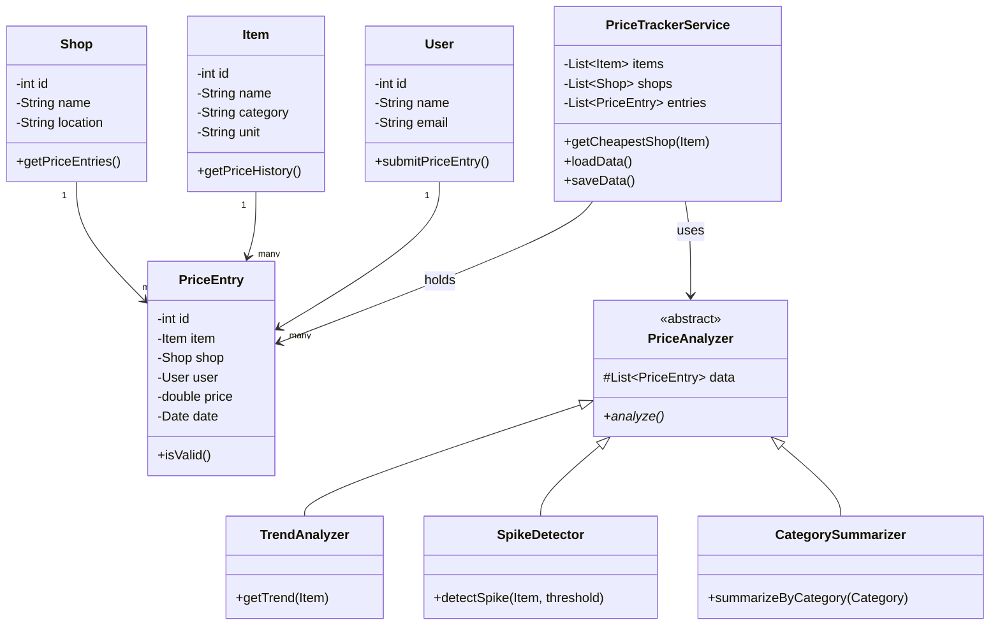

# System Design — Price Pulse

## Class Diagram

## Schema

| Table/File | Fields |
|---|---|
| `items` | id (PK), name, category, unit |
| `shops` | id (PK), name, location |
| `users` | id (PK), name, email |
| `price_entries` | id (PK), item_id (FK→items), shop_id (FK→shops), user_id (FK→users), price, date |

## Rules
- A `PriceEntry` always requires `item_id`, `shop_id`, and `user_id` — no nulls.
- Storage model: in-memory during runtime, loaded once at startup (`loadData()`) and saved on exit (`saveData()`). CRUD operations act on in-memory objects, not directly on storage.
- `PriceTrackerService` composes `PriceAnalyzer` subclasses — it does not extend them.